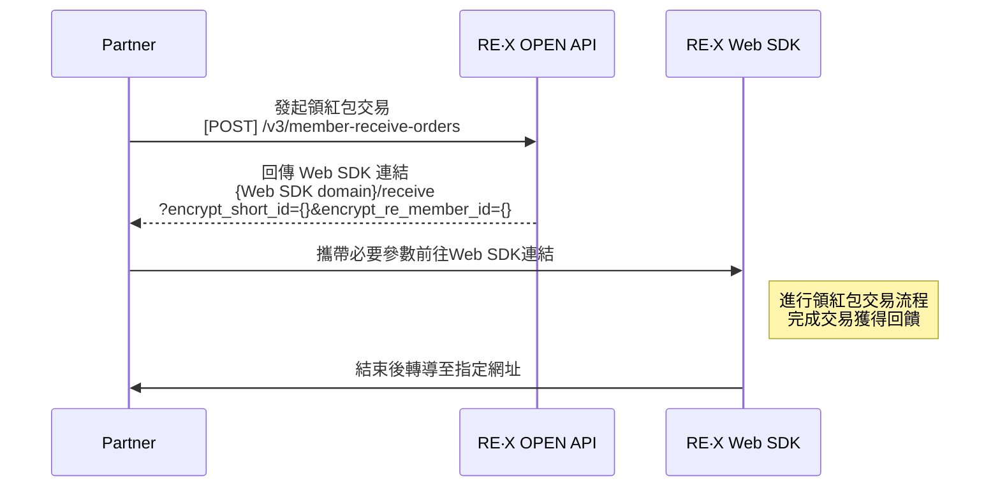

# 專案 Projects

[TOC]

## RE 紅包 / RE·X 點數魔術師

### RE·X 官方網站 / Web
> 與設計、前後端同事合作開發
> RE·X 官方形象網站 & 合作店家地圖(已移除)、列表 & 聯絡客服表單

專案時間: 2017 ~
專案連結: https://myre.life/
使用技術: `Nuxt.js@2 (SSR)`、`Vuex`、`Vue-i18n`、`Express.js`、`SCSS`、`TailwindCSS`、`TypeScript`、`VueUse`、`Axios`、`Pino`、`Leaflet`

全端開發 - Nuxt.js@2 SSR + Express.js 
- 實作 LRU Cache 快取策略
- 建構裝置指紋識別 Fingerprint
- 優化 SSR 效能
  - Bot 偵測與差異化處理
  - Lazy Hydration 延遲水合優化，提升首屏載入速度
- 重構日誌系統(Winston→Pino)
  - 效能提升 2-3 倍
  - Google Cloud Logging 原生支援
  - 自動敏感資料過濾(開發/生產環境差異化)
- 國際化與 SEO 優化
  - 多語系架構
  - 動態 Sitemap 生成含快取機制
  - 社群媒體 Deep Link 處理(Facebook、Instagram、LINE)
  - 動態 Meta Tags 用於 SEO 與社群分享

| 首頁 |店家列表|店家搜尋|
| -------- | -------- | -------- |
||||

### RE·X BOSS 店家管理系統 / Web
> 與設計、前後端同事合作開發
> 合作店家使用的平台，供店老闆、店員操作使用，功能包含處理交易、行銷工具、數據分析等，另有 RE Boss App 為 Hybrid 方式，因此需處理與 Native App 的溝通
> 串接 TapPay、Stripe 支援台灣、新加坡地區付款
> 實作 PDF/PNG 與 barcode/QR 生成功能，提供店家廣宣品下載

專案時間: 2017 ~
專案連結: https://boss.myre.life/
使用技術: `Vue.js@2.7`、`Vue/cli -> Vite`、`Vue-Router`、`Vuex`、`Vue-i18n`、`Express.js`、`SCSS`、`TailwindCSS`、`VueUse`、`Axios`、`D3`、`PDFmake`、`Sharp`、`Yup`

| 登入 |首頁|結帳|掃碼收款|收款碼
| -------- | -------- | -------- | -------- | -------- |
||||||

|結帳紀錄|請款|DateRange Picker |Time Input|Date Picker
| -------- | -------- | -------- | ------- | ------- |
||||||

| 會員分析 |圓餅圖|柱狀圖|熱力圖|折線圖|
| -------- | -------- | -------- | -------- | -------- |
||||||

### RE·X 市場開發系統 / Web
> 與後端同事合作開發
> 最初作為臨時需求的一頁表單後成長為一個平台
> 提供給市場開發業務、合作夥伴進行店家開發
> 能夠線上申請店家加入、申請藍新金流
> 串接 TapPay、Stripe 支援台灣、新加坡地區付款

專案時間: 2017 ~
專案連結: https://affiliate.myre.life/
使用技術: `Nuxt.js@2`、`Koa.js`、`Vuex`、`Vue-i18n`、`ElementUI`、`SCSS`、`TailwindCSS`、`Yup`、`Axios`、`Stripe`、`GoogleMapAPI`、`google-cloud/storage`

| 登入 | 首頁 |
| -------- | -------- |
|  | |

### RE·X Admin / Web
> 與前後端同事合作開發
> 企業內部管理後台，根據權限劃分提供給多個部門使用
> 有許多功能: 店家管理、會員管理、開發商管理、客服系統、工作單、會計撥款、發票、官方商城商品管理、交易查詢等

專案時間: 2017 ~
專案連結: 內部服務不公開
使用技術: `Vue.js@2.7`、`Nuxt.js@1 -> Vue/cli -> Vite`、`Vue-Router`、`Vuex`、`ElementUI`、`GraphQL / Apollo-Client`、`Express`、`SCSS`、`TailwindCSS`、`CKEditor@4`、`Axios`、`GoogleMapAPI`、`ESLint`、`Zod`

| 登入 | 交易查詢 | 交易明細 | 商品設定 |
| -------- | -------- | -------- | -------- |
| | |||

### RE·X RD CMS / Web
> 與前後端同事合作開發
> 僅供內部使用的內容管理系統
> 用於維護多種內容/版位模組（如 Banner、首頁版位/版型、活動參數、合作店家、店家列表與店家快取設定等）

專案時間: 2018 ~
專案連結: 內部服務不公開
使用技術: `Vue.js@2.7`、`Vue/cli`、`Vue-Router`、`Vuex`、`ElementUI`、`Pug`、`Express`、`SCSS`、`CKEditor@4`、`Axios`、`GoogleMapAPI`

### RE‧X LIFF (LINE Front-end Framework) / Web
> 與後端同事合作開發
> LINE Front-end Framework (LIFF) 是一個能在 LINE App 內部直接建立和運行網頁應用程式的框架。 
> 實作在 RE‧X 官方 LINE@ 帳號內可以直接進行查看購物金與掃碼/結帳碼交易的功能
> 掃碼成功後會轉導至 Web SDK 進行後續交易流程

專案時間: 2023 ~
專案連結: https://liff.line.me/1661236749-klWGZVgB
使用技術: `Vue.js@3`、`VuetifyUI`、`Vite`、`TypeScript`、`Express.js`、`VueUse`、`Axios`、`Vue-i18n`、`Pinia`、`Vue-Router`、`WindiCSS`、`ESLint`

| LINE@圖片選單 |我的購物金|結帳碼|
| -------- | -------- | -------- |
||||

### RE‧X Web SDK / Web
> 與後端同事合作開發
> 供合作廠商 (ex: HAPPYGO) 與 LINE@ LIFF 可以掃碼後進行交易
> 2024 年新增金流支付功能，可依據裝置不同使用 ApplePay, GooglePay 付款
> - [Apple Pay on Web](https://clipwww.github.io/blog/2024/08/05/apple-pay-on-web/)
> - [Google Pay on Web](https://clipwww.github.io/blog/2024/08/06/google-pay-on-web/)

專案時間: 2021 ~
使用技術: `Vue.js@3`、`VantUI`、`Vite`、`TypeScript`、`Express.js`、`VueUse`、`Axios`、`Vue-i18n`、`Pinia`、`Vue-Router`、`WindiCSS`、`ApplePayJS`、`GooglePayJS`、`ESLint`

#### 發起交易流程

| 交易金額 | 折抵、付款選項 | 付款方式 | 自訂折抵 | 自訂折抵 |
| -------- | -------- | -------- | -------- | -------- |
||||||

| ApplePay | ApplePay | 付款成功 | 紅包三選一 |
| -------- | -------- | -------- | -------- |
|||||

#### LINE@領紅包流程


### Check-In / Service
> 簽到活動服務
> 以 RESTful API 風格讓內部其他專案串接使用
> 排程檢查連續簽到紀錄
> 排程發出簽到提醒推播

專案時間: 2025 ~
使用技術: `Bun`、`TypeScript`、`Express.js`、`Redis`、`MySQL`、`Pino`、`Axios`、`CronJob`、`ESLint`

### Fami / Service
> 串接全家會員與全家點數平台 API 與紀錄請求、回應電文
> 以 RESTful API 風格讓內部其他專案串接使用

專案時間: 2024 ~
使用技術: `TypeScript`、`Express.js`、`Redis`、`MySQL`、`Zod`、`Pino`、`Axios`、`ESLint`

### Neweb Merchant / Service
> 接手維護
> 串接藍新金流(Neweb)平台商合作商家 API & 接收相關 Webhook
> 以 RESTful API 風格讓內部其他專案串接使用
> 串接藍接平台商商店補件 SFTP 上傳與排程拉取回覆檔

專案時間: 2024 ~
使用技術: `TypeScript`、`Express.js`、`Redis`、`MySQL`、`Zod`、`Pino`、`Axios`、`ESLint`

### POS / Service
> 與後端同事合作開發
> POS (Point of Sale) 交易、取消、退款、查詢、帳務 核心服務
> 供 POS 廠商串接

專案時間: 2025 ~
使用技術: `TypeScript`、`Express.js`、`Redis`、`MySQL`、`DrizzleORM`、`Zod`、`Pino`、`Got`、`ESLint`

### TapPay Direct Pay - iFrame / Vue 組件
> 串接 TapPay 無跳轉嵌入式信用卡付款
> 除了自訂的樣式外還有實作 Cardholder 表單
> 為了讓多個有串接 TapPay 的專案使用，實作為共用組件發佈到內部私有 npm

專案時間: 2019 ~
使用技術: `Vue.js@2`、`TapPay SDK`、`Vue-Class-Component`、`SCSS`

| 信用卡輸入 | 私有 NPM |
| -------- | -------- |
|  |  |

### 藍新金流嵌入式信用卡支付 / Vue 組件
> 因應國際間之支付卡產業資料安全標準協會(PCI Council)之規範，藍新要求原本使用「幕後授權」的平台商需要調整信用卡收款串接方式，更改使用藍新金流提供的嵌入式信用卡支付
> 實作為共用組件讓 RE·X App WebView 與 Web SDK 支付頁面使用

專案時間: 2025 ~
使用技術: `Vue.js@3`、`TypeScript`、`NewebPay SDK`、`VueUse`

| 信用卡支付 | 綁定卡片 |
| -------- | -------- |
|  ||

### 抵用券列表、詳情頁面 / Vue 組件
> 同時要使用在 App WebView 與 LINE@ LIFF 專案內
> 為減少開發以及後續維護成本實作為共用組件發佈到內部私有 npm
> 由於 2 個專案分別使用的是 Vue2 與 Vue3，利用 Vue-demi 針對不同版本的 Vue 打包出對應版本的內容
> 因此僅能使用 Vue2 Vue3 都有的語法來實作

專案時間: 2025 ~
使用技術: `Vue.js@2.7`、`Vue.js@3`、`Vue-demi`、`Vite`、`TypeScript`、`TailwindCSS`、`ESLint`

| 抵用券列表 | 抵用券詳情 | 私有 NPM |
| -------- | -------- | -------- |
|  |  |  |

### 店家資訊 / Vue 組件
> 店家資訊內容會在多個專案使用
> 為避免重覆複製貼上以及後續更新時的麻煩
> 實作為共用組件發佈到內部私有 npm

專案時間: 2019 ~
使用技術: `Vue.js@2`、`Vue/Cli -> Vite`、`Sass -> TailwindCSS`、`TypeScript`、`ESLint`

| 資訊頁 | 私有 NPM |
| -------- | -------- |
|  |  |

### 藍新金流工具 / Web
> 僅供內部使用，方便快速的查詢藍新金流交易
> 針對異常或爭議交易執行取消授權/退款
> 除了串接藍新金流 API 的核心 Service 為手寫外
> UI、API 以及整個操作流程皆由 AI Agent 生成

專案時間: 2025 ~
使用技術: `Bun`、`Nuxt.js@4`、`NuxtUI`、`TypeScript`、`MySQL`、`DrizzleORM`、`Zod`、`VueUse`

| 首頁 | 交易查詢 | 交易紀錄  | 取消授權/退款 |
| -------- | -------- | -------- | -------- |
| ![FireShot Capture 156 - 藍新金流交易查詢工具 - [prod-nmt-tool.myre.page]](https://hackmd.io/_uploads/H19PSoyNZl.png) |  |  | ![FireShot Capture 159 - 藍新取消授權_退款 - [prod-nmt-tool.myre.page]](https://hackmd.io/_uploads/r1BYHik4be.png) |

### 每日簽到送購物金 / Web / 行銷活動
> 串接[簽到服務](https://hackmd.io/_pTSmJN8Q2uEhjAjPiYUZg?view#Check-In--Service)，提供每日簽到、連續簽到贈送購物金
> push 使用者每天打開 APP

專案時間: 2025~
使用技術: `Vue.js@2.7`、`VueUse`、`Axios`、`TailwindCSS`、`dayjs`、`Vue-i18n`

| 首頁 | 寶箱三選一 | 寶箱三選一 | 簽到紀錄 |
| -------- | -------- | -------- | -------- |
|  |  |  |  

### 翻牌送購物金小遊戲 / Web / 行銷活動
> 與設計師合作開發
> 活動已結束，僅保留核心邏輯供新一檔活動替換圖片即可使用

專案時間: 2017~2018
專案連結: https://github.com/clipwww/memory-card-game
DEMO: https://clipwww.github.io/memory-card-game/
使用技術: `TypeScript`、`jQuery`、`SCSS`

### 刮刮樂送購物金小遊戲 / Web / 行銷活動
> 與設計師合作開發
> 活動已結束，僅保留核心邏輯供新一檔檔活動替換圖片即可使用

專案時間: 2018
專案連結: https://github.com/clipwww/scratchcard-game
DEMO: https://clipwww.github.io/scratchcard-game/
使用技術: `TypeScript`、`jQuery`、`SCSS`

### 接粽子送購物金小遊戲 / Web / 行銷活動
> 與設計師、前端同事合作開發
> 活動已結束，僅保留核心邏輯供新一檔活動替換圖片即可使用
> 第一次使用 PixiJS 製作遊戲，花了不少時間研究

專案時間: 2019
專案連結: https://github.com/clipwww/catch-game
DEMO: https://clipwww.github.io/catch-game/
使用技術: `PixiJS`、`Pixi-Sound`、`TypeScript`、`SCSS`

### 轉盤送購物金小遊戲 / Web / 行銷活動
> 與設計師合作開發
> 活動已結束，僅保留核心邏輯
> 為了[用 CSS Border 做三角形](https://clipwww.github.io/blog/2021/10/15/css-triangle/) + 動態改變輪盤數量，重新複習了三角函數
> 

專案時間: 2019
專案連結: https://github.com/clipwww/lucky-wheel-game
DEMO: https://clipwww.github.io/lucky-wheel-game/
使用技術: `TypeScript`、`SCSS`

### 樂彩券抽購物金小遊戲 / Web / 行銷活動
> 與設計師、後端同事合作開發
> 過年期間提供每天開獎送購物金的活動，消費即可獲得抽獎次數

專案時間: 2020、2023、2024
使用技術: `Vue.js@2`、`TypeScript`、`dayjs`、`VueUse`

| 活動首頁1 | 活動首頁2 | 開獎紀錄 | 選擇號碼 |
| -------- | -------- | -------- | -------- |
|||||

---
---
---

## FunNow

### FunNow Manager 商家後台管理系統
> 接手與後端同事合作維護、開發新功能
> 從 Vue/cli 遷移至 Vite 大幅提升專案啟動及熱重啟的速度
> 導入 Typescript 提升開發體驗（精準的自動補全、重構安全）、提高程式碼可讀性與可維護性（明確的型別定義）
> 配合前端團隊討論後的決定逐步使用 Vue Composition API 改寫 & 使用 Pinia 取代 vuex
> 與設計師合作重構 Date/Time/DateRange Picker

連結: https://boss.myfunnow.com/
使用技術: `Vue.js@2.7`、`Vue-Router`、`Vuetify`、`Vite`、`TypeScript`、`Pinia`、`Axios`、`Jest`、`Vue-i18n`、`WindiCSS`、`VueUse`、`ESLint`

| DateRange Picker | Date Picker | DateTime Picker | Time Picker |
| -------- | -------- | -------- | -------- |
|  |  |  | 

---
---
---

## 蝦米智慧媒體 Whats Media

### 統一時代百貨台北店官網
> 接手維護與後端同事合作開發新功能
> 實作美人塾線上預約功能
> 串接 Inline app 線上訂位店家列表 & HonestBee 外送店家列表

專案時間: 2016 ~ 已改版
連結: https://www.uni-ustyle.com.tw/
使用技術: `.NET MVC`、`C#`、`Razor`、`LINQ`、`SCSS`、`jQuery/Ajax`、`Vue.js@1`

### 勝悅髮型頭皮養護館群悅SPA養生館官網
> 與後端同事合作從無到有開發
> 有後台管理系統可以上架分店、產品等內容 & 管理會員與預訂資訊
> 會員帳號可綁定 Google / Facebook 登入
> 使用 Fullcalendar.js 實作美髮美容師排班設定、會員預訂時段的選擇與呈現

專案時間: 2016 ~
連結: https://www.goangyih.com/
使用技術: `.NET MVC`、`C#`、`Razor`、`LINQ`、`SCSS`、`jQuery/Ajax`、`Vue.js@1`

### 麗寶 Outlet MALL 官網
> 與後端同事合作從無到有開發
> 有後台管理系統可以上架分店、櫃位等內容

專案時間: 2017 ~
連結: http://www.lihpaooutlet.com.tw/
使用技術: `.NET MVC`、`C#`、`Razor`、`LINQ`、`SCSS`、`jQuery/Ajax`、`Vue.js@1`

### 電子看板內容
> 實作放置於林口三井 Outlet 美食街的電子看板輪播內容的其中幾頁
> 串接 AccuWeather API，提供桃園機場周邊天氣資訊
> 串接桃園機場航班資訊開放資料，提供近幾小時內的起降航班資訊

專案時間: 2016 ~ 已撤換
使用技術: `SCSS`、`jQuery/Ajax`

### GlobalMall 環球購物中心官網
> 與後端同事合作從無到有開發
> 有後台管理系統可以上架分店、櫃位等內容
> 串接環球購物中心會員系統 SOAP API 實作會員登入、註冊及帳號管理

專案時間: 2017 ~ 已改版
連結: https://www.twglobalmall.com/
使用技術: `.NET MVC`、`C#`、`Razor`、`LINQ`、`SCSS`、`jQuery/Ajax`、`Vue.js@2`

---
---
---

## SOHO

### 格上租車小遊戲
> 格上租車 APP 內的小遊戲
> 與設計師、後端合作開發
> 接手已經切好的畫面與已完成拋物線邏輯的射擊遊戲
> 增加遊戲關卡，怪物會隨著等級提升改變移動模式跟速度
> 建立後台管理介面，管理玩家與道具資料

專案時間: 2019 ~ 已結束
專案截圖: https://www.cake.me/portfolios/7890b0
射擊遊戲 DEMO: https://clipwww.github.io/shot-game/
使用技術: `PixiJS`、`Pixi-Sound`、`TypeScript`、`SCSS`、`Vue.js@2`、`ElementUI`、`Axios`

| 首頁 | 遊戲說明 | 遊戲畫面 | 遊戲說明 | 遊戲畫面 |
| -------- | -------- | -------- | -------- | -------- |
| |  |||

### GoShare 台南 GoNow EatNow
> GoShare 擴點至台南的行銷活動
> 與設計師合作開發
> 以設計師提供的手繪地圖為底，建立自定義的互動式地圖
> 爬蟲抓取特定 Instagram #hashtag 的貼文
> 簡易的管理後台，可將特定 IG 帳號加入黑名單，避免 hashtag 被無關的廣告污染

專案時間: 2020 ~ 活動已結束
使用技術: `Leaflet`、`Vue.js@2`、`SCSS`、`ElementUI`、`MongoDB`、`Cheerio`、`Axios`

| 地圖縮放 | 地圖(手機版) | 店家資訊 | 地圖(電腦版) | IG貼文 | IG貼文 |
| -------- | -------- | -------- | -------- | -------- | -------- |
| | ||||

