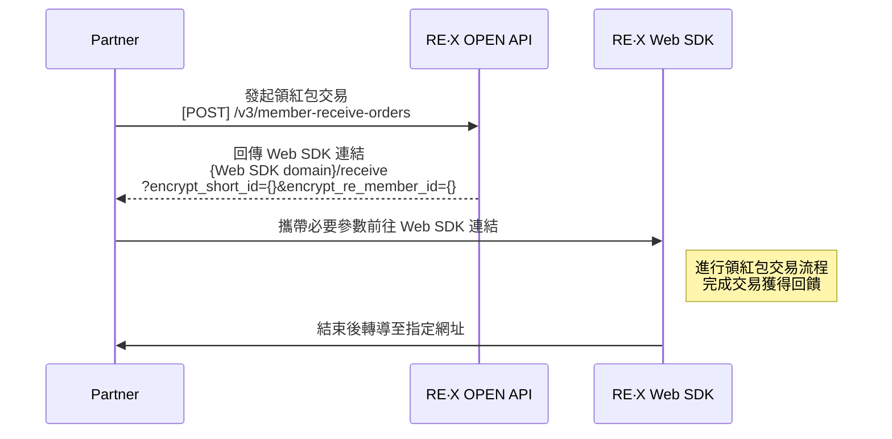

# RE 紅包 / RE·X 點數魔術師

RE·X 是一個點數回饋平台，我從 2017 年開始參與至今，負責多個核心專案的前端與全端開發。

---

## RE·X 官方網站

> 與設計、前後端同事協作開發  
> 負責 RE·X 官方形象網站與功能模組：合作店家地圖（已移除）、店家列表、聯絡客服表單

**專案時間:** 2017 ~  
**專案連結:** [https://myre.life/](https://myre.life/)

### 技術棧

`Nuxt.js@2 (SSR)` `Vuex` `Vue-i18n` `Express.js` `SCSS` `TailwindCSS` `TypeScript` `VueUse` `Axios` `Pino` `Leaflet`

### 開發內容

**全端開發（Nuxt2 SSR + Express.js）**

- 實作 LRU Cache 快取策略
- 建立裝置指紋（Fingerprint）識別機制
- 優化 SSR 效能
  - Bot 偵測與差異化處理
  - Lazy Hydration（延遲水合）優化，提升首屏載入速度
- 重構日誌系統（Winston → Pino）
  - 效能提升 2–3 倍
  - 原生支援 Google Cloud Logging
  - 自動過濾敏感資料（依開發/生產環境差異化處理）
- 國際化與 SEO 優化
  - 建立多語系架構
  - 動態 Sitemap 生成與快取機制
  - 社群媒體 Deep Link 處理（Facebook、Instagram、LINE）
  - 動態 Meta Tags，用於 SEO 與社群分享

### 專案截圖

<ImageCarousel 
  title="RE·X 官方網站"
  :images="[
    { src: 'https://hackmd.io/_uploads/BkFMflZV-g.png', alt: '首頁' },
    { src: 'https://hackmd.io/_uploads/Hk7G7lbVWl.png', alt: '店家列表' },
    { src: 'https://hackmd.io/_uploads/HJgszxZEZl.png', alt: '店家搜尋' }
  ]"
/>

---

## RE·X BOSS 店家管理系統

> 與設計、前後端同事協作開發  
> 合作店家使用的平台，提供店老闆與店員操作；功能涵蓋交易處理、行銷工具、數據分析等。另有 RE Boss App（Hybrid），需處理與 Native App 的互動與溝通

**專案時間:** 2017 ~  
**專案連結:** [https://boss.myre.life/](https://boss.myre.life/)

### 技術棧

`Vue.js@2.7` `Vue/cli -> Vite` `Vue-Router` `Vuex` `Vue-i18n` `Express.js` `SCSS` `TailwindCSS` `VueUse` `Axios` `D3` `PDFmake` `Sharp` `Yup`

### 開發內容

**全端開發（Vue2 + Express.js）**

- Hybrid App 處理 Web 與 Native App 溝通
- 建立多語系架構
- 串接 TapPay、Stripe，支援台灣/新加坡地區付款
- 用 Sharp、pdfmake 實作圖片生成，提供店家結帳立牌與廣宣品下載
- 用 D3.js 實作資料視覺化
- 將專案從 Vue/cli 遷移至 Vite，大幅提升專案啟動與熱重載速度

### 專案截圖 - 核心功能

<ImageCarousel 
  title="核心功能"
  :images="[
    { src: 'https://hackmd.io/_uploads/rybwPgbVbg.png', alt: '登入' },
    { src: 'https://hackmd.io/_uploads/r1YhPxbEWx.png', alt: '首頁' },
    { src: 'https://hackmd.io/_uploads/ry51txbE-l.png', alt: '結帳' },
    { src: 'https://hackmd.io/_uploads/BJtnveW4Wl.png', alt: '掃碼收款' },
    { src: 'https://hackmd.io/_uploads/rytnwgZNZx.png', alt: '收款碼' }
  ]"
/>

### 專案截圖 - 交易與日期選擇

<ImageCarousel 
  title="交易與日期選擇"
  :images="[
    { src: 'https://hackmd.io/_uploads/Sk10tlbNWx.png', alt: '結帳紀錄' },
    { src: 'https://hackmd.io/_uploads/BJYhDxZ4-x.png', alt: '請款' },
    { src: 'https://hackmd.io/_uploads/rJK2vgbE-e.png', alt: 'DateRange Picker' },
    { src: 'https://hackmd.io/_uploads/B1K3wl-4bx.png', alt: 'Time Input' },
    { src: 'https://hackmd.io/_uploads/SklFnwxWVbl.png', alt: 'Date Picker' }
  ]"
/>

### 專案截圖 - 資料視覺化

<ImageCarousel 
  title="D3.js 資料視覺化"
  :images="[
    { src: 'https://hackmd.io/_uploads/B1t2weZ4We.png', alt: '會員分析' },
    { src: 'https://hackmd.io/_uploads/r1FnPgbV-e.png', alt: '圓餅圖' },
    { src: 'https://hackmd.io/_uploads/r1Klhx-E-e.png', alt: '柱狀圖' },
    { src: 'https://hackmd.io/_uploads/Syu3DlbNWl.png', alt: '熱力圖' },
    { src: 'https://hackmd.io/_uploads/H1FnveWNbg.png', alt: '折線圖' }
  ]"
/>

---

## RE·X 市場開發系統

> 與後端同事協作開發  
> 起初為臨時需求的一頁式表單，後續逐步擴充為完整平台  
> 提供市場開發業務與合作夥伴進行店家開發  
> 支援線上申請店家加入與申請藍新金流

**專案時間:** 2017 ~  
**專案連結:** [https://affiliate.myre.life/](https://affiliate.myre.life/)

### 技術棧

`Nuxt.js@2` `Koa.js` `Vuex` `Vue-i18n` `ElementUI` `SCSS` `TailwindCSS` `Yup` `Axios` `Stripe` `GoogleMapAPI` `google-cloud/storage`

### 開發內容

**全端開發（Nuxt2 + Koa.js）**

- 建立多語系架構
- 將專案從 Nuxt1 遷移至 Nuxt2
- 串接 TapPay、Stripe，支援台灣/新加坡地區付款
- 實作表單流程
  - 多步驟表單
  - 動態欄位顯示與驗證
  - 證件、文件檔案上傳 Google Cloud Storage 與預覽
  - 利用 Google Maps API 抓取店家座標與英文地址自動補全

### 專案截圖

<ImageCarousel 
  title="RE·X 市場開發系統"
  :images="[
    { src: 'https://hackmd.io/_uploads/rJTbqAlE-e.png', alt: '登入' },
    { src: 'https://hackmd.io/_uploads/rkjz5RxVZl.png', alt: '首頁' }
  ]"
/>

---

## RE·X Admin

> 與前後端同事協作開發  
> 企業內部管理後台，依權限控管提供多部門使用  
> 店家管理、會員管理、開發商管理、客服系統、工作單、會計撥款、發票、官方商城商品管理、交易查詢等

**專案時間:** 2017 ~

### 技術棧

`Vue.js@2.7` `Nuxt.js@1 -> Vue/cli -> Vite` `Vue-Router` `Vuex` `ElementUI` `GraphQL / Apollo-Client` `Express` `SCSS` `TailwindCSS` `CKEditor@4` `Axios` `GoogleMapAPI` `ESLint` `Zod`

### 開發內容

**全端開發（Vue2 + Express.js）**

- 將專案從 Nuxt1 遷移至 Vue/cli，後隨時間經過再遷移至 Vite，大幅提升專案啟動與熱重載速度
- 建立多個表單組件，快速應對各種不同需求的設定
- 獨自負責了約 80% 的功能開發（前端部分）

---

## RE·X RD CMS

> 與前後端同事協作開發  
> 僅供內部使用的內容管理系統  
> 用於維護多種內容/版位模組（如 Banner、首頁版位/版型、活動參數、合作店家、店家列表與店家快取設定等）

**專案時間:** 2018 ~

### 技術棧

`Vue.js@2.7` `Vue/cli` `Vue-Router` `Vuex` `ElementUI` `Pug` `Express` `SCSS` `CKEditor@4` `Axios` `GoogleMapAPI`

---

## RE‧X LIFF (LINE Front-end Framework)

> 與後端同事協作開發  
> LINE Front-end Framework（LIFF）可在 LINE App 內直接建立並執行網頁應用程式  
> 實作 RE‧X 官方 LINE@ 入口：查看購物金、掃碼/結帳碼交易等功能  
> 掃碼成功後轉導至 Web SDK，進行後續交易流程

**專案時間:** 2023 ~  
**專案連結:** [https://liff.line.me/1661236749-klWGZVgB](https://liff.line.me/1661236749-klWGZVgB)

### 技術棧

`Vue.js@3` `VuetifyUI` `Vite` `TypeScript` `Express.js` `VueUse` `Axios` `Vue-i18n` `Pinia` `Vue-Router` `WindiCSS` `ESLint`

### 專案截圖

<ImageCarousel 
  title="RE‧X LIFF"
  :images="[
    { src: 'https://hackmd.io/_uploads/SJk8nhl4We.png', alt: 'LINE@圖片選單' },
    { src: 'https://hackmd.io/_uploads/BJrEh2e4Wx.png', alt: '我的購物金' },
    { src: 'https://hackmd.io/_uploads/r1kd2hxEZe.png', alt: '結帳碼' }
  ]"
/>

---

## RE‧X Web SDK

> 與後端同事協作開發  
> 提供合作廠商（例如 HAPPYGO）與 LINE@ LIFF 掃碼後進行交易

**專案時間:** 2021 ~

### 技術棧

`Vue.js@3` `VantUI` `Vite` `TypeScript` `Express.js` `VueUse` `Axios` `Vue-i18n` `Pinia` `Vue-Router` `WindiCSS` `ApplePayJS` `GooglePayJS` `ESLint`

### 開發內容

**全端開發（Vue3 + Express.js）**

- 串接 Apple Pay on Web 與 Google Pay on Web，提供無縫付款體驗
  - [Apple Pay on Web](https://clipwww.github.io/blog/2024/08/05/apple-pay-on-web/)
  - [Google Pay on Web](https://clipwww.github.io/blog/2024/08/06/google-pay-on-web/)

### 專案截圖

<ImageCarousel 
  title="Web SDK 付款流程"
  :images="[
    { src: 'https://hackmd.io/_uploads/ryRDNalVWl.png', alt: '交易金額' },
    { src: 'https://hackmd.io/_uploads/SJ3wBpgV-l.png', alt: '折抵、付款選項' },
    { src: 'https://hackmd.io/_uploads/HyRDVTlNbg.png', alt: '付款方式' },
    { src: 'https://hackmd.io/_uploads/ryAP46xVWe.png', alt: '自訂折抵' },
    { src: 'https://hackmd.io/_uploads/ByAw4TgEZx.png', alt: '自訂折抵確認' },
    { src: 'https://hackmd.io/_uploads/SyRDEpeVWx.png', alt: 'ApplePay' },
    { src: 'https://hackmd.io/_uploads/SyRvEpeE-g.png', alt: 'ApplePay 確認' },
    { src: 'https://hackmd.io/_uploads/HyAPN6e4bg.png', alt: '付款成功' },
    { src: 'https://hackmd.io/_uploads/HJyOV6xE-e.png', alt: '紅包三選一' }
  ]"
/>

### LINE@ 領紅包流程影片

<iframe 
  width="100%" 
  height="400" 
  src="https://www.youtube.com/embed/ug5CMZEjB1U" 
  title="RE‧X LINE@ 領紅包流程" 
  frameborder="0" 
  allow="accelerometer; autoplay; clipboard-write; encrypted-media; gyroscope; picture-in-picture; web-share" 
  allowfullscreen
  style="border-radius: 8px; max-width: 720px;"
></iframe>

### 發起交易流程

---

## 後端服務

### Check-In Service

> 簽到活動服務  
> 以 RESTful API 風格提供內部其他專案串接使用  
> 排程檢查連續簽到紀錄  
> 排程發出簽到提醒推播

**專案時間:** 2025 ~

`Bun` `TypeScript` `Express.js` `Redis` `MySQL` `Pino` `Axios` `CronJob` `ESLint`

### Fami Service

> 串接全家會員與全家點數平台 API，並記錄請求/回應電文  
> 以 RESTful API 風格提供內部其他專案串接使用

**專案時間:** 2024 ~

`TypeScript` `Express.js` `Redis` `MySQL` `Zod` `Pino` `Axios` `ESLint`

### Neweb Merchant Service

> 接手維護  
> 串接藍新金流（Neweb）平台商合作商家 API，並接收相關 Webhook  
> 以 RESTful API 風格提供內部其他專案串接使用  
> 串接藍新平台商商店補件：SFTP 上傳與排程拉取回覆檔

**專案時間:** 2024 ~

`TypeScript` `Express.js` `Redis` `MySQL` `Zod` `Pino` `Axios` `ESLint`

### POS Service

> 與後端同事協作開發  
> POS（Point of Sale）交易、取消、退款、查詢、帳務等核心服務  
> 提供 POS 廠商串接

**專案時間:** 2025 ~

`TypeScript` `Express.js` `Redis` `MySQL` `DrizzleORM` `Zod` `Pino` `Got` `ESLint`

---

## Vue 組件

### TapPay Direct Pay - iFrame

> 串接 TapPay 無跳轉嵌入式信用卡付款  
> 除了自訂樣式外，亦實作 Cardholder 表單  
> 為了支援多個串接 TapPay 的專案，封裝為共用組件並發佈至內部私有 npm

**專案時間:** 2019 ~

`Vue.js@2` `TapPay SDK` `Vue-Class-Component` `SCSS`

<ImageCarousel 
  title="TapPay 信用卡組件"
  :images="[
    { src: 'https://hackmd.io/_uploads/Bkykf6kEWe.png', alt: '信用卡輸入' },
    { src: 'https://hackmd.io/_uploads/rkdIUa1VWl.png', alt: '私有 NPM' }
  ]"
/>

### 藍新金流嵌入式信用卡支付

> 因應支付卡產業資料安全標準協會（PCI Council）規範，藍新要求原本使用「幕後授權」的平台商調整信用卡收款串接方式，改採藍新金流提供的嵌入式信用卡支付  
> 封裝為共用組件，供 RE·X App WebView 與 Web SDK 支付頁面使用

**專案時間:** 2025 ~

`Vue.js@3` `TypeScript` `NewebPay SDK` `VueUse`

<ImageCarousel 
  title="藍新金流嵌入式信用卡"
  :images="[
    { src: 'https://hackmd.io/_uploads/SkE6t6JN-l.png', alt: '信用卡支付' },
    { src: 'https://hackmd.io/_uploads/B1lMqTy4Zx.png', alt: '綁定卡片' }
  ]"
/>

### 抵用券列表、詳情頁面

> 同時使用於 App WebView 與 LINE@ LIFF 專案  
> 為降低開發與後續維護成本，封裝為共用組件並發佈至內部私有 npm  
> 由於兩個專案分別使用 Vue 2 與 Vue 3，透過 Vue-demi 針對不同版本打包對應產物  
> 因此僅能使用 Vue 2 / Vue 3 皆支援的語法實作

**專案時間:** 2025 ~

`Vue.js@2.7` `Vue.js@3` `Vue-demi` `Vite` `TypeScript` `TailwindCSS` `ESLint`

<ImageCarousel 
  title="抵用券組件"
  :images="[
    { src: 'https://hackmd.io/_uploads/BkSIZnJ4-g.png', alt: '抵用券列表' },
    { src: 'https://hackmd.io/_uploads/Hydl-hyEbg.png', alt: '抵用券詳情' },
    { src: 'https://hackmd.io/_uploads/rkfC0iJV-l.png', alt: '私有 NPM' }
  ]"
/>

### 店家資訊

> 店家資訊內容會在多個專案中重複使用  
> 為避免重複複製貼上並降低後續更新成本  
> 封裝為共用組件並發佈至內部私有 npm

**專案時間:** 2019 ~

`Vue.js@2` `Vue/Cli -> Vite` `Sass -> TailwindCSS` `TypeScript` `ESLint`

<ImageCarousel 
  title="店家資訊組件"
  :images="[
    { src: 'https://hackmd.io/_uploads/rk3A5s1Ebg.png', alt: '資訊頁' },
    { src: 'https://hackmd.io/_uploads/ryzKqokEWg.png', alt: '私有 NPM' }
  ]"
/>

---

## 內部工具

### 藍新金流工具

> 僅供內部使用，用於快速查詢藍新金流交易  
> 支援針對異常或爭議交易執行取消授權/退款  
> 串接藍新金流 API 的核心 Service 為手寫  
> UI、API 與整體操作流程由 AI Agent 生成

**專案時間:** 2025 ~

`Bun` `Nuxt.js@4` `NuxtUI` `TypeScript` `MySQL` `DrizzleORM` `Zod` `VueUse`

<ImageCarousel 
  title="藍新金流工具"
  :images="[
    { src: 'https://hackmd.io/_uploads/H19PSoyNZl.png', alt: '首頁' },
    { src: 'https://hackmd.io/_uploads/BkskDj1Ebx.png', alt: '交易查詢' },
    { src: 'https://hackmd.io/_uploads/HysmDjJE-g.png', alt: '交易紀錄' },
    { src: 'https://hackmd.io/_uploads/r1BYHik4be.png', alt: '取消授權/退款' }
  ]"
/>

---

## 行銷活動

### 每日簽到送購物金

> 串接簽到服務，提供每日簽到與連續簽到贈送購物金  
> 透過推播引導使用者每日開啟 App

**專案時間:** 2025 ~

`Vue.js@2.7` `VueUse` `Axios` `TailwindCSS` `dayjs` `Vue-i18n`

<ImageCarousel 
  title="每日簽到活動"
  :images="[
    { src: 'https://hackmd.io/_uploads/r1kg26JVbx.png', alt: '首頁' },
    { src: 'https://hackmd.io/_uploads/r1klh6k4be.png', alt: '寶箱三選一' },
    { src: 'https://hackmd.io/_uploads/B1Jg36y4-l.png', alt: '寶箱開獎' },
    { src: 'https://hackmd.io/_uploads/rJJx3akV-e.png', alt: '簽到紀錄' }
  ]"
/>

### 翻牌送購物金小遊戲

> 與設計師合作開發  
> 活動已結束，保留核心邏輯供下一檔活動替換素材即可使用

**專案時間:** 2017~2018  
**DEMO:** [https://clipwww.github.io/memory-card-game/](https://clipwww.github.io/memory-card-game/)

`TypeScript` `jQuery` `SCSS`

### 刮刮樂送購物金小遊戲

> 與設計師合作開發  
> 活動已結束，保留核心邏輯供下一檔活動替換素材即可使用

**專案時間:** 2018  
**DEMO:** [https://clipwww.github.io/scratchcard-game/](https://clipwww.github.io/scratchcard-game/)

`TypeScript` `jQuery` `SCSS`

### 接粽子送購物金小遊戲

> 與設計師、前端同事合作開發  
> 活動已結束，保留核心邏輯供下一檔活動替換素材即可使用  
> 第一次使用 PixiJS 製作遊戲，投入時間研究與落地

**專案時間:** 2019  
**DEMO:** [https://clipwww.github.io/catch-game/](https://clipwww.github.io/catch-game/)

`PixiJS` `Pixi-Sound` `TypeScript` `SCSS`

### 轉盤送購物金小遊戲

> 與設計師合作開發  
> 活動已結束，僅保留核心邏輯  
> 為了[用 CSS Border 做三角形](https://clipwww.github.io/blog/2021/10/15/css-triangle/)並支援動態改變輪盤數量，重新複習三角函數應用

**專案時間:** 2019  
**DEMO:** [https://clipwww.github.io/lucky-wheel-game/](https://clipwww.github.io/lucky-wheel-game/)

`TypeScript` `SCSS`

### 樂彩券抽購物金小遊戲

> 與設計師、後端同事合作開發  
> 過年期間提供每天開獎送購物金的活動，消費即可獲得抽獎次數

**專案時間:** 2020、2023、2024

`Vue.js@2` `TypeScript` `dayjs` `VueUse`

<ImageCarousel 
  title="樂彩券活動"
  :images="[
    { src: 'https://hackmd.io/_uploads/Hy22fC1Vbl.png', alt: '活動首頁1' },
    { src: 'https://hackmd.io/_uploads/Hy23MAy4Ze.png', alt: '活動首頁2' },
    { src: 'https://hackmd.io/_uploads/HJh3z01EZx.png', alt: '開獎紀錄' },
    { src: 'https://hackmd.io/_uploads/Hk33fAJEWx.png', alt: '選擇號碼' }
  ]"
/>
