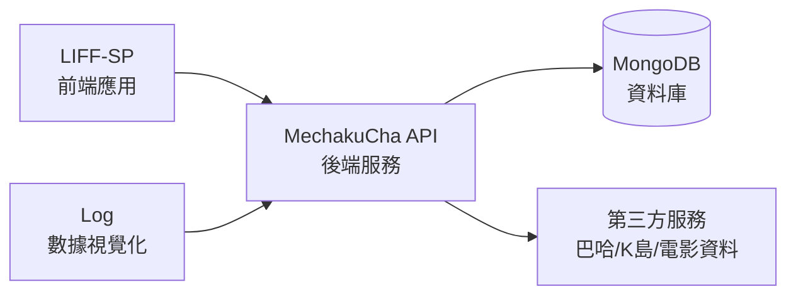

# 個人專案 Side Projects

這裡是我在工作之餘開發的一些個人專案，主要用於技術練習、生活記錄和小工具開發。

---

## 📊 Log - 個人生活記錄

個人生活數據視覺化專案，用於記錄和分析日常生活數據。

### 功能特色

- 🎬 **電影觀影紀錄** - 記錄觀影場次、影城分佈、消費統計，並以熱力圖、長條圖等方式呈現
- ⚾ **進場看球紀錄** - 記錄職棒比賽觀賽紀錄，包含場地分佈、主場勝率等統計
- ~~🏃 **小米手環數據** - 整合運動數據和每日活動量，以貢獻度熱圖和折線圖呈現~~ (懶得匯出資料已停止維護)

### 技術棧

| 類別 | 技術 |
|------|------|
| 前端框架 | Vue 3 + TypeScript |
| UI 元件 | Vant |
| 樣式 | TailwindCSS |
| 圖表 | Chart.js、D3.js |
| 建構工具 | Vite 7 |
| 程式碼規範 | @antfu/eslint-config |

### 截圖

#### 電影紀錄

<ImageCarousel :images="[
  { src: 'https://hackmd.io/_uploads/HkOEeDmHbg.png', alt: '電影紀錄 - 資料總覽' },
  { src: 'https://hackmd.io/_uploads/S1FPgDXB-e.png', alt: '電影紀錄 - 貢獻度熱圖' },
  { src: 'https://hackmd.io/_uploads/S1EdgwmS-e.png', alt: '電影紀錄 - 觀影列表' },
  { src: 'https://hackmd.io/_uploads/rJn_lDXHWg.png', alt: '電影紀錄 - 場次統計' },
  { src: 'https://hackmd.io/_uploads/rJ4KgvmHbe.png', alt: '電影紀錄 - 時間熱力圖' },
  { src: 'https://hackmd.io/_uploads/B1jtxwQB-l.png', alt: '電影紀錄 - 影城分佈' },
  { src: 'https://hackmd.io/_uploads/ryNqxvmrWg.png', alt: '電影紀錄 - 版本統計' }
]" />

#### 棒球入場紀錄

<ImageCarousel :images="[
  { src: 'https://hackmd.io/_uploads/H1tW-vQBbl.png', alt: '棒球入場紀錄' }
]" />

### 線上展示

🔗 [https://clipwww.github.io/log/](https://clipwww.github.io/log/)

---

## 🚀 MechakuCha API - 後端 API 服務

一個整合多種服務的後端 API 專案，提供彈幕資料、動畫資訊、電影時刻等功能。

### 功能特色

- 📺 **彈幕服務** - 取得巴哈姆特動畫瘋、Bilibili、NicoNico 等平台的彈幕資料
- 🎌 **動畫資訊** - 整合 Agefans、向日葵動畫等平台的番劇資訊
- 🎬 **電影時刻** - 取得台灣各影城電影場次資訊
- 📱 **K島爬蟲** - 抓取 Komica 新番實況/捏他版內容
- 🤖 **LINE Bot** - LINE 訊息機器人整合
- 📡 **推播通知** - Web Push 和 LINE Notify 支援

### 技術棧

| 類別 | 技術 |
|------|------|
| 框架 | Hono.js + OpenAPIHono |
| API 文件 | Scalar (OpenAPI 3.0) |
| 資料庫 | MongoDB |
| 部署平台 | Vercel |
| 排程任務 | Agenda |
| 爬蟲 | Cheerio、Puppeteer |

### API 文件

🔗 [https://mechakucha-api.vercel.app/docs](https://mechakucha-api.vercel.app/docs)

---

## 📱 LIFF-SP - LINE Front-end Framework 應用

基於 LINE LIFF (LINE Front-end Framework) 開發的 Web 應用，整合多種生活服務功能。

### 功能特色

- 🎬 **電影時刻查詢** - 查詢各影城電影場次，支援收藏功能
- ~~📺 **向日葵動畫** - 瀏覽動畫列表、觀看影片並顯示彈幕~~ (向日葵已關閉)
- 📋 **K島瀏覽器** - 瀏覽新番實況/捏他版內容，支援圖片預覽
- 🥬 **大頭菜預測** - 動物森友會大頭菜價格預測工具，支援群組功能
- 🐛 **動森圖鑑** - 查詢魚類、蟲類、化石等資訊 `WIP`

### 技術棧

| 類別 | 技術 |
|------|------|
| 前端框架 | Vue 2 |
| UI 元件 | Vant |
| LINE 整合 | LIFF SDK |
| 狀態管理 | Vuex |
| 建構工具 | Vite |
| 即時資料 | Firebase |

## 截圖

<ImageCarousel :images="[
  { src: 'https://images.cakeresume.com/post-images/cd72a6b9-f9eb-4504-8774-47f33abd1138.png', alt: 'LIFF-SP - 大頭菜預測' },
  { src: 'https://images.cakeresume.com/post-images/ed32da56-e3ee-46ec-ae06-e7bfc7b01db0.png' },
  { src: 'https://images.cakeresume.com/post-images/abfb0675-cd8e-4c90-889d-56edbf954e55.png' },
  { src: 'https://images.cakeresume.com/post-images/4d3d7f4c-f8cb-4e7a-a736-9a7b560e379f.png' }
]" />

### 線上展示

🔗 [https://clipwww.github.io/liff-sp/](https://clipwww.github.io/liff-sp/)

---

## 專案關聯

- **LIFF-SP** 作為 LINE 內的前端應用入口
- **MechakuCha API** 提供後端資料服務
- **Log** 用於個人數據的視覺化呈現
